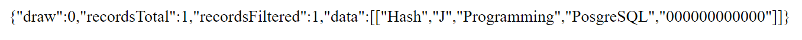
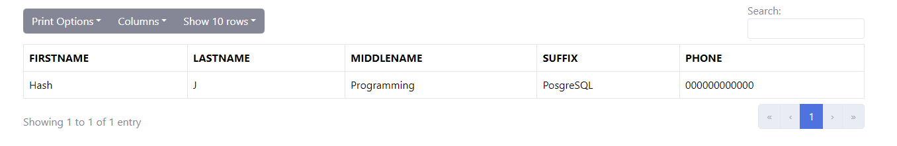

# SSP Class for DataTables with MySQL and PostgreSQL
This repository contains the modified SSP (Server-Side Processing) class for DataTables, specifically designed to work with PostgreSQL databases.

## Preview of the DataTables with PostgreSQL
The following screenshots show the DataTables with PostgreSQL in action:





## Getting Started

To get started with using the modified SSP class for DataTables with PostgreSQL, follow these steps:

1. Clone or download this repository to your local machine.
2. Include the `ssp.class.posgres.php` file in your project.
3. Configure the database connection settings in the `script.php` file.
4. Use the SSP class methods to handle server-side processing for your DataTables.

## Examples 

Here are a few examples to demonstrate how to use the modified SSP class with DataTables:
`test_db.sql` - This file contains the SQL backup of the PostgreSQL database that can be used for testing purposes.

```sql
-- SQL backup of the test database
-- Created on: <date>
-- Created by: <your name>

-- Database: test

-- Table structure for table "users"
CREATE TABLE IF NOT EXISTS users (
    id SERIAL PRIMARY KEY,
    firstname VARCHAR(50) NOT NULL,
    lastname VARCHAR(50) NOT NULL,
    middlename VARCHAR(50),
    suffix VARCHAR(10),
    phone VARCHAR(20)
);

-- Insert sample data into the "users" table
INSERT INTO users (firstname, lastname, middlename, suffix, phone)
VALUES
    ('John', 'Doe', 'Smith', 'Jr', '123-456-7890'),
    ('Jane', 'Smith', 'Marie', '', '987-654-3210'),
    ('Michael', 'Johnson', 'Robert', 'Sr', '555-123-4567');
```

You can use this SQL script to restore the `test` database in PostgreSQL and populate the `users` table with sample data for testing purposes.

Remember to adjust the file paths and database connection settings in your project accordingly.

`index.php` - This file contains the HTML structure for the DataTables table and the JavaScript code to initialize the DataTables plugin.

```html
<!doctype html>
<html lang="en">

<head>
    <title>PosgresSQL - DataTable</title>
    <!-- Required meta tags -->
    <meta charset="utf-8" />
    <meta
        name="viewport"
        content="width=device-width, initial-scale=1, shrink-to-fit=no" />

    <!-- Bootstrap CS -->
    <link
        rel="stylesheet"
        href="assets/bootstrap/css/bootstrap.min.css" />
</head>

<body>
    <header>
        <!-- place navbar here -->
    </header>
    <main>
        <div class="container">
            <table class="table table-hover table-bordered my-0" id="dataTable">
                <thead>

                </thead>
                <tbody>

                </tbody>
                <tfoot>

                </tfoot>
            </table>
        </div>
    </main>
    <footer>
        <!-- place footer here -->
    </footer>
    <!-- Bootstrap JavaScript Libraries -->
    <script src="assets/js/jquery.min.js"></script>
    <script src="assets/bootstrap/js/bootstrap.min.js"></script>
    <script src="assets/js/datatables.min.js"></script>
    <script src="assets/js/main.js"></script>
    <script>
        $(document).ready(function() {
            columns = [{
                    title: "FIRSTNAME",
                    data: 0
                },
                {
                    title: "LASTNAME",
                    data: 1
                },
                {
                    title: "MIDDLENAME",
                    data: 2
                },
                {
                    title: "SUFFIX",
                    data: 3
                },
                {
                    title: "PHONE",
                    data: 4
                },
            ];
            api = "script.php";
            initializeDataTable(api, columns);
        });
    </script>
</body>

</html>
```

`main.js` - This file contains the JavaScript code to initialize the DataTables plugin with server-side processing.
```javascript
function initializeDataTable(api, columns) {
    if ($.fn.DataTable.isDataTable("#dataTable")) {
      $("#dataTable").DataTable().destroy();
    }
  
    $("#dataTable").DataTable({
      ajax: api,
      processing: true,
      serverSide: true,
      columns: columns,
      search: {
        return: true,
      },
      layout: {
        topStart: {
          buttons: [
            //  Add your buttons here
          ],
        },
      },
      responsive: {
        details: {
          display: DataTable.Responsive.display.modal({
            header: function (row) {
              var data = row.data();
              return "Details for " + data[0] + " " + data[1];
            },
          }),
          renderer: DataTable.Responsive.renderer.tableAll({
            tableClass: "table",
          }),
        },
      },
      stateSave: true,
      select: true,
    });
  }

```

`script.php` - This file contains the server-side processing logic to fetch data from the PostgreSQL database using the SSP_PGSQL class.
```php
<?php
 
// This is a simple example of how to use the SSP_PGSQL class to get data from a PostgreSQL database
$table = 'users';
// Table's primary key
$primaryKey = 'id';
 
// Columns to display
$columns = array(
    array( 'db' => 'firstname', 'dt' => 0 ),
    array( 'db' => 'lastname',  'dt' => 1 ),
    array( 'db' => 'middlename',   'dt' => 2 ),
    array( 'db' => 'suffix',     'dt' => 3 ),
    array( 'db' => 'phone',     'dt' => 4)
);
 
// SQL server connection information
$sql_details = array(
    'user' => 'postgres',
    'pass' => 'postgres',
    'db'   => 'test',
    'host' => 'localhost',
    'port' => '5432',
    'charset' => 'utf8'
);
 
// Include the SSP_PGSQL class
require( 'ssp.class.posgres.php' );

//  SSO_PGSQL::complex is used for complex queries
// echo json_encode(
//     SSP_PGSQL::complex( $_GET, $sql_details, $table, $primaryKey, $columns )
// );

// SSO_PGSQL::simple is used for simple queries
echo json_encode(
    SSP_PGSQL::simple( $_GET, $sql_details, $table, $primaryKey, $columns )
);
```

## File Structure

Here is the file structure of the repository:

```
/G:/xampp/htdocs/DataTable SSP Class MySQL-PosgreSQL
├── README.MD
├── screenshots
│   ├── image-1.png
│   └── image-2.png
│   └── image.png
├── index.php
├── script.php
├── assets
│   ├── bootstrap
│   │   └── css
│   │       └── bootstrap.min.css
│   ├── js
│   │   ├── jquery.min.js
│   │   ├── datatables.min.js
│   │   └── main.js
└── ssp.class.posgres.php
```

You can use this tree to visualize the file structure of the repository.

You can also refer to the official DataTables documentation for more examples and information on server-side processing: [DataTables Server-side Processing](https://datatables.net/examples/data_sources/server_side)

## Contributing

Contributions are welcome! If you have any suggestions, bug reports, or feature requests, please open an issue or submit a pull request.

## License

This modified SSP class for DataTables with PostgreSQL is licensed under the [MIT License](https://opensource.org/licenses/MIT).

```               
                                                MIT License

                                    Copyright (c) 2024 Joshua Ambalong

                Permission is hereby granted, free of charge, to any person obtaining a copy
                of this software and associated documentation files (the "Software"), to deal
                in the Software without restriction, including without limitation the rights
                to use, copy, modify, merge, publish, distribute, sublicense, and/or sell
                copies of the Software, and to permit persons to whom the Software is
                furnished to do so, subject to the following conditions:

                The above copyright notice and this permission notice shall be included in all
                copies or substantial portions of the Software.

                THE SOFTWARE IS PROVIDED "AS IS", WITHOUT WARRANTY OF ANY KIND, EXPRESS OR
                IMPLIED, INCLUDING BUT NOT LIMITED TO THE WARRANTIES OF MERCHANTABILITY,
                FITNESS FOR A PARTICULAR PURPOSE AND NONINFRINGEMENT. IN NO EVENT SHALL THE
                AUTHORS OR COPYRIGHT HOLDERS BE LIABLE FOR ANY CLAIM, DAMAGES OR OTHER
                LIABILITY, WHETHER IN AN ACTION OF CONTRACT, TORT OR OTHERWISE, ARISING FROM,
                OUT OF OR IN CONNECTION WITH THE SOFTWARE OR THE USE OR OTHER DEALINGS IN THE
                SOFTWARE.
```